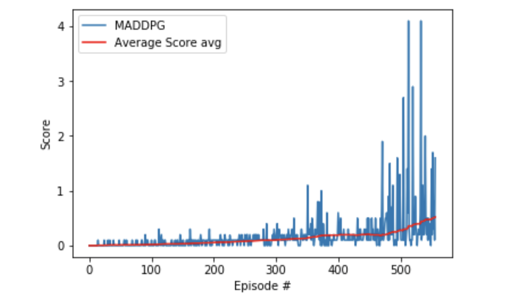

# Solution

I followed the following steps to complete this project.

1. Using a random action policy to establish a performance baseline. My results from this step showed that is the agent chose random actions it would achieve a score in the range of -0.004999999888241291 to 0.2. This is not good enough for meeting the project requirements. 
1. Choosing a good algorithm for training is critical in completing this task. For this project, I implemented a Multi-Agent Deep Deterministic Policy Gradient (MADDPG) algorithm.
1. Then the experimentation part comes in where you tune hyperparameters until the performance threshold is reached.
##### &nbsp;

### 1. Establish Baseline
Getting a baseline using random guessing to help you determine how much improvement you have made over randomly guessing actions.

##### &nbsp;

### 2. Implement a Learning Algorithm
Similar to the last project, i used policy based algorithm since we have a continuous action space and value-based methods won't scale. Here are the advantages of policy-based methods: 
Here are some advantages of policy-based methods:
- **Continuous action spaces** &mdash; Policy-based methods are well-suited for continuous action spaces.
- **Stochastic policies** &mdash; Policy-based methods can learn true stochastic policies.
- **Simplicity** &mdash; Policy-based methods directly learn the optimal policy, no need to maintain a separate value function estimate. 

##### &nbsp;

#### Multi-Agent Deep Deterministic Policy Gradient (MADDPG)
This project uses a Deep Deterministic Policy Gradient (DDPG) method detailed in this paper [_Continuous Control with Deep Reinforcement Learning_](https://arxiv.org/pdf/1509.02971.pdf)

1. For the Deep Deterministic Policy Gradient (DDPG) the code was used from the [single-agent DDPG code template](https://github.com/udacity/deep-reinforcement-learning/tree/master/ddpg-pendulum). 
1. Modifications were made to make it suitable for the multiple competitive agents in the Tennis environment; these modifications were taken from [this paper](https://papers.nips.cc/paper/7217-multi-agent-actor-critic-for-mixed-cooperative-competitive-environments.pdf)
1. The project implemented an Actor-critic method to leverage the strengths of both policy-based and value-based methods. This implementation uses a **decentralized actor with centralized critic** approach from [the paper by Lowe and Wu](https://papers.nips.cc/paper/7217-multi-agent-actor-critic-for-mixed-cooperative-competitive-environments.pdf). 

##### &nbsp;

#### Exploration vs Exploitation
Since the agent starts the episode without knowing what action to take, we need to help with this dilemma by allowing it to explore and learn good and bad actions.  This is known as the **exploration vs. exploitation dilemma**. using a 𝛆-greedy algorithm allows the agent to systematically manage the exploration vs. exploitation trade-off. The agent "explores" by picking a random action with some probability epsilon `𝛜`, the agent continues to "exploit" its knowledge of the environment by choosing actions based on the deterministic policy with probability (1-𝛜). Since the environment doesn't have discrete actions instead we have movement with a high degree of magnitude and directions, and if we use this mechanism to sample uniformly, we could end up with actions that have a zero mean and thus cancel each other out. This will make learning hard, and it will just oscillate without making progress. To overcome this we use the **Ornstein-Uhlenbeck process**, as suggested in a [paper by Google DeepMind](https://arxiv.org/pdf/1509.02971.pdf) (see page 4). The Ornstein-Uhlenbeck process adds noise to the action values at each timestep. This noise is correlated to previous noise and tends to stay in the same direction for longer durations without the canceling effect.

#### Model Architecture
The Udacity provided DDPG code in PyTorch was used and adapted for this 20 agent environment.

The algorithm uses two deep neural networks (actor-critic) with the following struture:
- Actor    
    - Hidden: (input, 128)  - ReLU
    - Hidden: (128, 128)    - ReLU
    - Output: (128, 4)      - TanH

- Critic
    - Hidden: (input, 128)              - ReLU
    - Hidden: (128 + action_size, 128)  - ReLU
    - Output: (128, 1)                  - Linear

#### Hyperparamters
The following Hyperparamters were used:

```
BUFFER_SIZE = int(1e6)  # replay buffer size
BATCH_SIZE = 128        # minibatch size
LR_ACTOR = 1e-3         # learning rate of the actor
LR_CRITIC = 1e-3        # learning rate of the critic
WEIGHT_DECAY = 0        # L2 weight decay
LEARN_EVERY = 5         # learning timestep interval
LEARN_NUM = 5           # number of learning passes
GAMMA = 0.99            # discount factor
TAU = 7e-2              # for soft update of target parameters
OU_SIGMA = 0.2          # Ornstein-Uhlenbeck noise parameter, volatility
OU_THETA = 0.11         # Ornstein-Uhlenbeck noise parameter, speed of mean reversion
EPS_START = 5.5         # initial value for epsilon in noise decay process in Agent.act()
EPS_EP_END = 250        # episode to end the noise decay process
EPS_FINAL = 0           # final value for epsilon after decay
```


Ornstein-Uhlenbeck process itself has three hyperparameters that determine the noise characteristics and magnitude:
- mu: the long-running mean
- theta: the speed of mean reversion
- sigma: the volatility parameter

After a few experiments, I found my optimal values for  sigma was 0.2 and theta = 0.11 . The reduced noise volatility helped the model converge faster. An epsilon parameter was used to decay the noise level over time so that . more noise is introduced earlier in the training process (i.e., higher exploration), and the noise decreases over time as the agent gains more experience. 

The Noise parameters were as:
```
OU_SIGMA = 0.2          # Ornstein-Uhlenbeck noise parameter, volatility
OU_THETA = 0.11         # Ornstein-Uhlenbeck noise parameter, speed of mean reversion
```

The decay parameters were set as follows:
```
EPS_START = 5.5         # initial value for epsilon in noise decay process in Agent.act()
EPS_EP_END = 250        # episode to end the noise decay process
EPS_FINAL = 0           # final value for epsilon after decay
```

##### &nbsp;

#### Learning Interval
Initially, i had the LEARN_EVERY = 1. In general, I found that performing multiple learning passes per episode yielded faster convergence and higher scores; however, setting it to one made training slow and i could achieve the same results using LEARN_EVERY = 5. This did make training faster, and it still performed well. 


The learn parameters were set as follows:
```python
LEARN_EVERY = 5         # learning interval (no. of episodes)
LEARN_NUM = 5           # number of passes per learning step
```

##### &nbsp;

#### Gradient Clipping

There is a really good [ariticle](https://machinelearningmastery.com/exploding-gradients-in-neural-networks/) by Jason Brownlee that explains gradient clipping well. I've purchased his entire book collection btw! He explains it as follows, each layer in the NN amplifies the gradient it receives, the lower layers of the network accumulate huge gradients thus making their respective weight updates too large to allow the model to learn anything. to solve this issue, gradient clipping was implemented using the `torch.nn.utils.clip_grad_norm_` function.

##### &nbsp;

#### Experience Replay
Experience replay allows the RL agent to learn from experience.

A replay buffer stores a collection of experience tuples with the state, action, reward, and next state `(s, a, r, s').` The critic samples randomly from this buffer in the learning step; this also has the advantage of improving learning through repetition. 

##### &nbsp;

## Results
The Environment was solved in 457 episodes!  


The graph below shows the final training results. 




##### &nbsp;

## Future Improvements

- **Batch Normalization** &mdash; Batch normalization was not used on this project. The [Google DeepMind paper](https://arxiv.org/pdf/1509.02971.pdf) talks about the benefits of using this approach.
  - Similar to the exploding gradient, running computations on large input values makes learning inefficient. Batch normalization addresses this problem by scaling the features to be within the same range throughout the model and across different environments and units. The range of values is often much smaller, typically between 0 and 1.
